# Biểu đồ Lớp (Class Diagram) - Wild-Life Eco Simulation

## PlantUML Class Diagram

```plantuml
@startuml

' ========== Physics Package ==========
package ecosystem.physics {
    class Vector2D {
        - double x
        - double y
        + Vector2D(double x, double y)
        + double getX()
        + double getY()
        + Vector2D add(Vector2D other)
        + Vector2D subtract(Vector2D other)
        + Vector2D multiply(double scalar)
        + Vector2D normalize()
        + double distanceTo(Vector2D other)
    }

    interface IMovable {
        + Vector2D getVelocity()
        + void setVelocity(Vector2D velocity)
        + double getBaseSpeed()
    }

    interface ICollidable {
        + boolean isSolid()
    }

    interface IYieldable {
        + int getPriority()
        + boolean mustYieldTo(IYieldable other)
    }
}

' ========== Behavior Package ==========
package ecosystem.behavior {
    interface State {
        + void handle(Animal animal, Environment env)
    }

    interface SurvivalStrategy {
        + void execute(Animal animal, Environment env)
        + String getName()
    }

    class WanderingState {
        + void handle(Animal animal, Environment env)
    }

    class HungryState {
        + void handle(Animal animal, Environment env)
    }

    class ThirstyState {
        + void handle(Animal animal, Environment env)
    }

    class PassiveStrategy {
        + void execute(Animal animal, Environment env)
        + String getName()
        - Vector2D findUnvisitedDirection(Animal animal, Environment env)
    }

    class HunterStrategy {
        - double visionRange
        + void execute(Animal animal, Environment env)
        + String getName()
        - Animal findNearestPrey(Animal hunter, List<Animal> animals)
        - boolean isPrey(Animal hunter, Animal other)
        - boolean shouldExpandSearch(Animal animal)
    }

    class ScaredStrategy {
        - double visionRange
        + void execute(Animal animal, Environment env)
        + String getName()
        - Animal findNearestThreat(Animal prey, List<Animal> animals)
        - Vector2D findNearestForest(Animal animal, Environment env)
    }

    class AggressiveStrategy {
        + void execute(Animal animal, Environment env)
        + String getName()
    }

    State <|.. WanderingState
    State <|.. HungryState
    State <|.. ThirstyState

    SurvivalStrategy <|.. PassiveStrategy
    SurvivalStrategy <|.. HunterStrategy
    SurvivalStrategy <|.. ScaredStrategy
    SurvivalStrategy <|.. AggressiveStrategy
}

' ========== Entities Package ==========
package ecosystem.entities {
    abstract class Entity {
        # Vector2D position
        # double radius
        + Entity(Vector2D position, double radius)
        + Vector2D getPosition()
        + double getRadius()
        + void update()
    }

    abstract class Animal {
        - String name
        - int health
        - int hunger
        - int thirst
        - State state
        - SurvivalStrategy strategy
        - Vector2D velocity
        - Vector2D direction
        - double baseSpeed
        - double speedBoost
        - int priority
        - boolean predator
        - int attackDamage
        - boolean canSwim
        - boolean canWalk
        - int hungerRate
        - String actionState
        - int restTimer
        - int eatTimer
        - int drinkTimer
        - Set<String> visitedPositions
        - int explorationRange
        + Animal(Vector2D position, double radius, String name, int health, double speed, int priority, boolean predator)
        + void act(Environment env)
        + void move(Environment env)
        + Entity findFood(Environment env)
        + void eat()
        + boolean drink(Environment env)
        + void takeDamage(int damage)
        + void setState(State state)
        + void setStrategy(SurvivalStrategy strategy)
        + void setDirection(Vector2D direction)
        + String getName()
        + int getHealth()
        + int getHunger()
        + void setHunger(int hunger)
        + int getThirst()
        + void setThirst(int thirst)
        + State getState()
        + SurvivalStrategy getStrategy()
        + boolean isPredator()
        + int getAttackDamage()
        + void setSpeedBoost(double speedBoost)
        + boolean isAlive()
        + String getActionState()
        + void setActionState(String state)
        + boolean hasVisitedPosition(int x, int y)
        + void setExplorationRange(int range)
        + int getExplorationRange()
    }

    class Plant {
        - String type
        - boolean edible
        - double nutrition
        + Plant(Vector2D position, String type, boolean edible, double nutrition)
        + String getType()
        + boolean isEdible()
        + double getNutrition()
    }

    class Rabbit {
        + Rabbit(Vector2D position)
    }

    class Deer {
        + Deer(Vector2D position)
    }

    class Wolf {
        + Wolf(Vector2D position)
    }

    class Tiger {
        + Tiger(Vector2D position)
    }

    class Elephant {
        + Elephant(Vector2D position)
    }

    class Human {
        + Human(Vector2D position)
    }

    class Fish {
        + Fish(Vector2D position)
    }

    class Duck {
        + Duck(Vector2D position)
    }

    class Crocodile {
        + Crocodile(Vector2D position)
    }

    Entity <|-- Animal
    Entity <|-- Plant

    Animal <|-- Rabbit
    Animal <|-- Deer
    Animal <|-- Wolf
    Animal <|-- Tiger
    Animal <|-- Elephant
    Animal <|-- Human
    Animal <|-- Fish
    Animal <|-- Duck
    Animal <|-- Crocodile

    Animal ..> State : uses
    Animal ..> SurvivalStrategy : uses
    Animal ..|> IMovable : implements
    Animal ..|> ICollidable : implements
    Animal ..|> IYieldable : implements
}

' ========== Terrain Package ==========
package ecosystem.terrain {
    enum TerrainType {
        GRASS
        FOREST
        WATER
        MUD
        OBSTACLE
    }

    class Tile {
        - TerrainType type
        - int x
        - int y
        + Tile(int x, int y, TerrainType type)
        + TerrainType getType()
        + int getX()
        + int getY()
        + void setType(TerrainType type)
    }

    class Grid {
        - Tile[][] tiles
        - int width
        - int height
        + Grid(int width, int height)
        + Tile getTile(int x, int y)
        + void setTile(int x, int y, Tile tile)
        + Tile[][] getAllTiles()
        + int getWidth()
        + int getHeight()
    }
}

' ========== Environment Package ==========
package ecosystem.environment {
    class Environment {
        - Grid grid
        - List<Animal> animals
        - List<Plant> plants
        - Season season
        + Environment(int width, int height)
        + void update()
        + void addAnimal(Animal animal)
        + void addPlant(Plant plant)
        + void removeAnimal(Animal animal)
        + void removePlant(Plant plant)
        + List<Animal> getAnimals()
        + List<Plant> getPlants()
        + Grid getGrid()
        + Entity findNearestFood(Animal animal)
        + boolean hasWaterNearby(Animal animal)
        + boolean isWalkable(int x, int y)
        + double getSpeedModifier(int x, int y)
        + Season getSeason()
        + void nextSeason()
        + enum Season { SPRING, SUMMER, AUTUMN, WINTER }
    }

    Environment --> Grid : contains
    Environment --> Animal : manages
    Environment --> Plant : manages
}

' ========== View Package ==========
package ecosystem.view {
    abstract class BasicView {
        - Environment environment
        - SimulationController controller
        - JPanel mapPanel
        - JLabel infoLabel
        - int cellSize
        - double zoomLevel
        - int offsetX
        - int offsetY
        - Point lastMousePos
        - String actionMode
        + BasicView(Environment environment)
        + void update()
        + void setController(SimulationController controller)
        - void renderMap(Graphics g)
        - Color getAnimalColor(Animal animal)
        - void handleMapClick(MouseEvent e)
        - void showAnimalInfo(Animal animal)
    }

    class GraphicalView {
        - boolean useSprites
        - Map<String, Image> spriteCache
        + GraphicalView(Environment environment)
        - void renderMap(Graphics g)
        - void loadSprites()
        - Image getAnimalSprite(Animal animal)
        - Image getPlantSprite(Plant plant)
        - Image getTerrainSprite(TerrainType type)
    }

    BasicView <|-- GraphicalView
    BasicView --> Environment : displays
}

' ========== Controller Package ==========
package ecosystem.controller {
    class SimulationController {
        - Environment environment
        - GraphicalView view
        - Timer timer
        - Random random
        + SimulationController(int width, int height)
        + void initialize()
        - void addRandomAnimal()
        - void addAnimalByType(int type)
        - void addRandomPlant()
        - void updateSimulation()
        + void togglePause()
        + boolean isPaused()
        + void stop()
    }

    SimulationController --> Environment : controls
    SimulationController --> GraphicalView : controls
}

' ========== Main ==========
class Main {
    + static void main(String[] args)
}

Main --> SimulationController : creates

@enduml
```



## Mối quan hệ chính

### Kế thừa (Inheritance)
- `Entity` → `Animal`, `Plant`
- `Animal` → `Rabbit`, `Deer`, `Wolf`, `Tiger`, `Elephant`, `Human`, `Fish`, `Duck`, `Crocodile`
- `BasicView` → `GraphicalView`
- `State` → `WanderingState`, `HungryState`, `ThirstyState`
- `SurvivalStrategy` → `PassiveStrategy`, `HunterStrategy`, `ScaredStrategy`, `AggressiveStrategy`

### Thực thi (Implementation)
- `Animal` implements `IMovable`, `ICollidable`, `IYieldable`

### Liên kết (Association)
- `Environment` contains `Grid`, `List<Animal>`, `List<Plant>`
- `SimulationController` controls `Environment` and `GraphicalView`
- `BasicView` displays `Environment`
- `Animal` uses `State` and `SurvivalStrategy`

### Phụ thuộc (Dependency)
- `Main` creates `SimulationController`

## Kiến trúc tổng thể

```
Main
  ↓
SimulationController (Controller)
  ↓
Environment (Model) ←→ BasicView/GraphicalView (View)
  ↓
Grid
  ↓
Tile (TerrainType)
  ↓
Animal (implements IMovable, ICollidable, IYieldable)
  ↓
State (Pattern) + SurvivalStrategy (Pattern)
```

## Design Patterns được sử dụng

1. **State Pattern**: `State` interface với các implement `WanderingState`, `HungryState`, `ThirstyState`
2. **Strategy Pattern**: `SurvivalStrategy` interface với các implement `PassiveStrategy`, `HunterStrategy`, `ScaredStrategy`, `AggressiveStrategy`
3. **MVC Pattern**: 
   - Model: `Environment`, `Entity`, `Animal`, `Plant`
   - View: `BasicView`, `GraphicalView`
   - Controller: `SimulationController`
4. **Interface Segregation**: `IMovable`, `ICollidable`, `IYieldable` tách biệt các trách nhiệm
